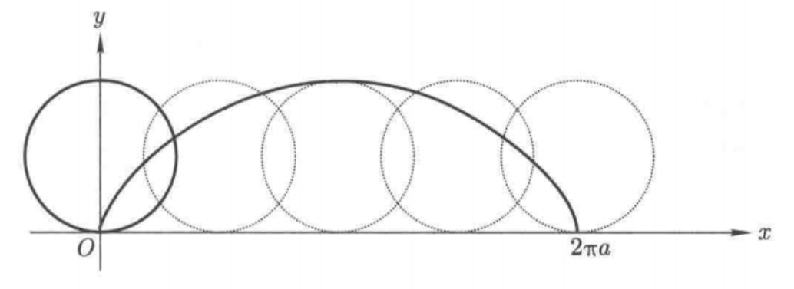
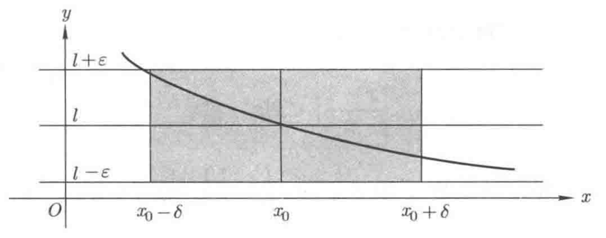

## 函数极限

### 函数

#### 函数的概念

> @info
>
> **定义 1 ：** 设 $A$ 是 $\mathbb{R}$ 的非空子集，若对于 $A$ 中的每一个数 $x$，都有唯一确定的 $y\in \mathbb{R}$ 与之对应（即**单值性**），将 $y$ 记成 $f(x)$，那么，就称 $f$ 是 $A$ 上的一个**实值函数**。集合 $A$ 称为 $f$ 的**定义域**，而数 $f(x)$ 称为 $f$ 的**值**。$f$ 的一切值的集合叫做 $f$ 的**值域**，通常记成 $f(A)$，即 $f(A)=\{y| y=f(x), x\in A\}$。习惯上，称 $x$ 为**自变量**，$y$ 为**因变量**。

1. 函数的三个基本要素：定义域、值域、（单值的）对应关系。

    * 一个函数也可以看成一个将 $A \subset \mathbb{R}$ 映入 $\mathbb{R}$ 内的映射：$f:A\longrightarrow \mathbb{R}$ 或 $f:x \longmapsto y = f(x)$。

2. 函数的值域 $f(A)$ 的性态——3种重要情形：

    1. ==函数的值域== ==$f(A)$== ==是一个有界数集。==

        > @info
        >
        > **定义 2 ：** 若 $\exist M>0$，使得 $\forall x \in A, \ |f(x)| \leq M$，则称函数 $f$ 为 $A$ 上的**有界函数**，或者说函数 $f$ 在 $A$ 上**有界**。
        
    2. ==定义域== ==$A$== ==与值域== ==$f(A)$==  **==同序==**​==（或者==​**==反序==**​==）。==

        即 $A$ 中任意两个数 $x_1, x_2$ 的大小顺序，均与他们对应的值域 $f(A)$ 中的两个数 $y_1=f(x_1), y_2=f(x_2)$ 的大小顺序相同（或者相反），此时称函数 $f(x)$ 是**单调的**。确切地说

        > @info
        >
        > **定义 3 ：**
        >
        > 1. 若 $\forall x_1, x_2\in A$，如果 $x_1<x_2$，有 $f(x_1)\leq f(x_2)$，就称 $f(x)$ 为 $A$ 上的**单调增函数**。
        > 2. 若 $\forall x_1, x_2\in A$，如果 $x_1<x_2$，有 $f(x_1)\geq f(x_2)$，就称 $f(x)$ 为 $A$ 上的**单调减函数**。
        >
        > 单调增函数和单调减函数，统称为**单调函数**。若上面的不等号为严格不等号，则称 $f(x)$ 为**严格单调增（减）函数**。
        
    3. ==定义域== ==$A$== ==与值域== ==$f(A)$== ==一一对应。==

        即对每一个 $y \in f(A)$，都有唯一确定的 $x\in A$ 使得 $f(x)=y$。从函数图像上看，就是任何一条平行与 $x$ 轴的直线，与函数的图像至多有一个交点（**单射**）。

        > @info
        >
        > **定义 4 ：** 此时，自然地导出一个由 $f(x)$ 到 $A$ 的映射。这个映射称为 $f(x)$ d额**反函数**（或**逆映射**），记为 $f^{-1}$，即 $x=f^{-1}(y)$。它的定义域为 $f(A)$，值域为 $A$。
        >

        很明显，若 $f$ 是 $A$ 上的严格单调的函数，则 $f$ 必然是 $A$ 到 $f(A)$ 的一个一一映射，因此也就有反函数。

#### 函数的复合

> @info
>
> **定义 5 ：** 设有函数 $y=f(u)$，定义域为 $B$，值域为 $C$；$u=g(x)$，定义域为 $A$。如果函数 $g(x)$ 的值域 $g(A)$ 包含在 $B$ 内，那么由
>
> $$
> f \circ g(x) = f(g(x))
> $$
>
> 定义了一个新函数 ==$f \circ g$==，称之为 $f$ 与 $g$ 的**复合函数**，它的定义域是 $A$。通常记为 $y=f(g(x))$，而称 $u$ 为**中间变量**。

1. 理解：从映射的角度看，复合函数就是从 $A$ 到 $B$ 再到 $C$ 的一个映射。
2. 性质：

    1. 满足结合律：$(f \circ g) \circ h=f\circ(g \circ h)$，用 $f\circ g \circ h$ 表示。
    2. **不满足**交换律：$f \circ g$ 与 $g \circ f$ 一般并不相同。

#### 初等函数

> @info
>
> **定义 6 ：** 最基本的函数是常数函数、幂函数、指数函数、对数函数、三角函数与反三角函数，称它们为**基本初等函数**。由基本初等函数经过<u>有限次</u>加、减、乘、除和复合运算得出的函数称为**初等函数**。

1. **多项式函数**：形如 $f(x)=a_nx^n+\cdots+a_1x+a_0$ 的函数。
2. **有理函数**：两个多项式函数 $f(x), g(x)$ 的商 $\frac{f(x)}{g(x)}$，它的定义域是不包括满足 $g(x)=0$ 的所有实数。
3. **幂函数**：形如 $f(x)=x^\alpha$ 的函数，其中 $\alpha$ 可以是任意实数。

    * 如果 $\alpha$ 是整数，$f(x)$ 就是有理函数。
    * 如果 $\alpha = \frac{1}{m}$，$m\geq2$ 且 $m$ 为正整数，$f(x)=x^{\frac{1}{m}}=\sqrt[m]{x}$ 是**根式函数**。

      * 如果 $m$ 是偶数，$f$ 的定义域为 $x\geq 0$；如果 $m$ 是奇数，$f$ 对任意 $x$ 有定义。
    * 如果 $\alpha$ 是无理数，$f$ 的定义域==一般规定为== ==$x>0$==。
4. **双曲函数**：指如下四个函数（**双曲正弦函数**、**双曲余弦函数**、**双曲正切函数**、**双曲余切函数**），它们的定义域是 $\mathbb{R}$。

    $$
    \sinh{x}=\frac{e^x-e^{-x}}{2},
    $$

    $$
    \cosh{x}=\frac{e^x+e^{-x}}{2},
    $$

    $$
    \tanh{x}=\frac{e^x-e^{-x}}{e^x+e^{-x}},
    $$

    $$
    \coth{x}=\frac{e^x+e^{-x}}{e^x-e^{-x}}(x\neq0).
    $$

    * 性质（与三角函数十分相似）：

      $$
      \sinh{(-x)}=-\sinh{x},\ \cosh{(-x)}=\cosh{x},
      $$

      $$
      \sinh{(x\pm y)}=\sinh{x}\cosh{y} \pm \cosh{x}\sinh{y},
      $$

      $$
      \cosh{(x\pm y)}=\cosh{x}\cosh{y} \pm \sinh{x}\sinh{y},
      $$

      $$
      \cosh^2{x}-\sinh^2{x}=1, \sinh{2x}=2\sinh{x}\cosh{x},\cosh{2x}=\cosh^2{x}+\sinh^2{x}.
      $$
5. **幂指函数**：形如 $f(x)=[u(x)]^{v(x)}$ 的函数，其中 $u(x)$ 和 $v(x)$ 都是关于 $x$ 的函数，且通常要求 $u(x)>0$。

    * 为什么幂指函数属于初等函数？

      $f(x)=[u(x)]^{v(x)}=e^{v(x)\cdot\ln{u(x)}}$，是指数函数、对数函数等的复合运算。

#### 函数的表达方式

1. 函数的**显（示）表示**：函数 $y=f(x)$ 的表达方式。
2. **分段函数**：对于自变量不同的取值范围，相应的函数表达式（即对应关系）不同。

    * **符号函数**：以符号标志函数，例如，

      $$
      y=\mathrm{sgn} x=
      \begin{cases}
      1,\,\,x>0\\
      0,\,\,x=0\\
      -1,\,\,x<0
      \end{cases}
      $$
3. 函数的**隐表示**：自变量和因变量之间的对应关系是通过一个方程给出来的，因此称这类函数为**隐函数**。

    * 不是每个函数的隐表示都可以从方程中解出。
4. 函数的**参数方程表示**：曲线上点的两个坐标 $x$ 与 $y$ 之间的关系是通过一个参数相联系的，即 $x$ 和 $y$ 可表示成下列形式：

    $$
    \begin{cases}
    x = x(t),\\
    y = y(t),
    \end{cases} 
    t \in [\alpha, \beta].
    $$

    * 理解：

      1. 这样的参数方程也可以看成从 $[\alpha, \beta] \subset \mathbb{R}$ 到平面 $Oxy$ 内的一个映射

          $$
          \bm{r}: [\alpha, \beta] \to \mathbb{R}^2,
          $$

          映射的像是 $Oxy$ 平面上的一条曲线。由平面上点与向量的对应关系，可以把映射表示成

          $$
          t \longmapsto \bm{r}(t)=(x(t),y(t)),
          $$

          所以有时候也称之为**向量值函数**。
      2. 在函数的参数方程表示中，$x$ 和 $y$ 的地位是完全平等的。

    * 与显示表示的关系：

      1. 一般情况下，参数方程表示的函数（以及它对应的曲线）不能写出通常的显示表示。
      2. 如果 $x=x(t)$ 在<u>某个局部</u>存在反函数 $t=x^{-1}(x)$，那么 $y=y(t)=y(x^{-1}(x))$ 给出 $x$ 和 $y$ 之间的显示表示。
    * 典例——**摆线**：一个半径为 $a$ 的圆沿着 $x$ 轴匀速而无滑动地滚动时，圆上一固定点 $P$ 的运动轨迹。

      

      设 $t=0%$ 时 $P$ 点位于原点，则在任何 $t$ 时刻，$P$ 点的坐标 $(x,y)$ 分别为

      $$
      \begin{cases}
      x=a(t-\sin t), \\
      y=a(1-\cos t).
      \end{cases}
      $$

      这就是变量 $x$ 和 $y$ 都依赖参数 $t$ 的参数方程表示。

### 函数的极限的概念

#### 函数在无穷大处的极限

> @info
>
> **定义 1 ：** 设函数 $y=f(x)$ 至少在 $|x|>a>0$ 有定义。如果有一个实数 $l$ 具有下列性质：$\forall \varepsilon >0, \ \exist X=X(\varepsilon)>a$，使 $\forall |x|>X$，有
>
> $$
> |f(x)-l|<\varepsilon,
> $$
>
> 那么称**当** **$x$** **趋向无穷大时，**​**$f(x)$** **以** **$l$** **为极限**，记成
>
> $$
> \lim_{x\to \infty}f(x)=l \ \ 或\ \ f(x)\to l\  \ (x\to \infty).
> $$
>
> **定义 2 ：** 设函数 $y=f(x)$ 至少在 $|x|>a>0$ 有定义。如果有一个实数 $l$ 具有下列性质：
>
> 1. $\forall \varepsilon >0, \ \exist X=X(\varepsilon)>a$，使 $\forall x>X$，有 $|f(x)-l|<\varepsilon$，则称**当** **$x\to +\infty$** **时，**​**$f(x)$** **以** **$l$** **为极限**，记作 $\lim_{x\to +\infty}f(x)=l$。
> 2. $\forall \varepsilon >0, \ \exist X=X(\varepsilon)>a$，使 $\forall x< -X$，有 $|f(x)-l|<\varepsilon$，则称**当** **$x\to -\infty$** **时，**​**$f(x)$** **以** **$l$** **为极限**，记作 $\lim_{x\to -\infty}f(x)=l$。
>
> $f(x)$ 在正（或者负）无穷大处的极限，称为 $f(x)$ 在无穷大处的（两个）**单侧极限**。

1. 函数极限的几何体现：若 $\lim_{x\to \infty}f(x)=l$，则直线 $y=l$ 为曲线 $y=f(x)$ 的一条<u>水平渐近线</u>。
   
> @info
>
> **定理 1 ：** $\lim_{x\to \infty}f(x)$ 存在的充分必要条件，是两个单侧极限 $\lim_{x\to +\infty}f(x)$ 和 $\lim_{x\to -\infty}f(x)$ 存在且相等。
    

#### 函数在一点处的极限

> @info
>
> **定义 3 ：** 设 $f(x)$ 在 $x_0$ 附近有定义（<u>在 </u>​<u>$x_0$</u>​<u> 不要求有定义</u>）。如果有一个常数 $l$ 满足下述性质： $\forall \varepsilon > 0$，$\exist\delta>0$，使$\forall 0<|x-x_0|<\delta$（即 $\forall x\in \mathring{U}(x_0, \delta)$），有 $|f(x)-l|<\varepsilon$，那么称 $l$ 为**当** **$x$** **趋于** **$x_0$** **时** **$f(x)$** **的极限**，记成
>
> $$
> \lim_{x\to x_0}f(x)=l \ \ 或\ \ f(x)\to l\  \ (x\to x_0).
> $$
>
> **定义 4 ：**
>
> 1. 设 $f(x)$ 在 $x_0$ 的左侧附近有定义。如果有一个常数 $l$ 满足下述性质：$\forall \varepsilon > 0$，$\exist\delta>0$，使$\forall -\delta<x-x_0<0$，有 $|f(x)-l|<\varepsilon$，那么称 $l$ 是 $f(x)$ 在 $x_0$ 的**左极限**，将这个过程记成 $\lim_{x\to x_0^-}f(x)=l $ 或 $f(x)\to l\  \ (x\to x_0^-)$。
>
>     记函数 $f(x)$ 在 $x_0$ 的左极限为 ==$f(x_0 - 0)$==。
> 2. 设 $f(x)$ 在 $x_0$ 的右侧附近有定义。如果有一个常数 $l$ 满足下述性质：$\forall \varepsilon > 0$，$\exist\delta>0$，使$\forall 0<x-x_0<\delta$，有 $|f(x)-l|<\varepsilon$，那么称 $l$ 是 $f(x)$ 在 $x_0$ 的**右极限**，将这个过程记成 $\lim_{x\to x_0^+}f(x)=l $ 或 $f(x)\to l\  \ (x\to x_0^+)$。
>
>     记函数 $f(x)$ 在 $x_0$ 的右极限为 ==$f(x_0 + 0)$==。

1. 函数在某点存在极限 $\Rightarrow$ ==函数局部有界==。

    
    
2. $f(x_0 \pm 0)$ 仅表示函数在一点 $x_0$ 处的左、右极限，与函数 $f(x)$ 在 $x_0$ 处的取值没有必然关系。
3. > @info
    >
    > **定理 2 ：** 函数 $f(x)$ 在 $x_0$ 有极限的充分必要条件是 $f(x)$ 在 $x_0$ 的左、右极限都存在且相等。
    >

#### 重要函数极限

1. $$
    \lim_{x\to 0}{\frac{\sin{x}}{x}}=1, \ \lim_{x\to x_0}{\frac{\tan{x}}{x}}=1
    $$

    > @info
    >
    > **引理：** 设 $0<x<\frac{\pi}{2}$，则 $\sin{x}<x<\tan{x}$。
    >

    * 其他一系列看似显然成立的极限：

      1. $$
          \lim_{x\to 0}\sin{x}=0
          $$
      2. $$
          \lim_{x\to 0}{(1-\cos{x})} = 0
          $$
      3. $$
          \lim_{x\to x_0}{\sin{x}}=\sin{x_0}, \ \lim_{x\to x_0}{\cos{x}}=\cos{x_0}, \ \lim_{x\to x_0}{\tan{x}}=\tan{x_0}
          $$
2. $$
    \lim_{x \to \infty}(1+\frac{1}{x})^n = e
    $$

### 函数极限的性质和运算

#### 函数极限的性质

> @info
>
> **定理 1 ：** 若当 $x \to x_0$ 时，函数 $f(x)$ 有极限 $l$，则
>
> 1. 极限是唯一的。
> 2. （**局部有界性**）$f(x)$ 在 $x_0$ 的附近时有界的。即 $\exist M,\delta>0$，使 $\forall x \in \mathring{U}(x_0, \delta)$，有 $|f(x)|\leq M$。
> 3. （**局部保号性**）若 $a<l<b$，则在 $x_0$ 的附近，有 $a<f(x)<b$，即 $\exist\delta>0$，使 $\forall x \in \mathring{U}(x_0, \delta)$，有 $a<f(x)<b$。
>
> **定理 2 ：** 设当 $x \to x_0$ 时，函数 $f(x)$ 和 $g(x)$ 分别以 $l$ 和 $l'$ 为极限，则
>
> 1. 若在 $x_0$ 的附近，有 $f(x)\geq g(x)$，则 $l\geq l'$。
> 2. 若 $l\geq l'$，则在 $x_0$ 的附近，必有 $f(x)>g(x)$，即 $\exist \delta>0$，使 $\forall x \in \mathring{U}(x_0, \delta)$，有 $f(x)>g(x)$。
> 3. 作为 1 和 2 的推论，若在 $x_0$ 的附近，有 $f(x)\geq 0$，则 $l\geq 0$；若 $l>0$，则在 $x_0$ 的附近，有 $f(x)>0$。

#### 函数极限的运算

> @info
>
> **定理 3 ：** （**函数极限的运算法则**）设当 $x \to x_0$ 时，函数 $f(x)$ 和 $g(x)$ 有极限，则 $f(x)\pm g(x)$，$f(x)g(x)$，$\frac{f(x)}{g(x)}$（当 $\lim_{x\to x_0} g(x)\neq 0$ 时）均有极限，且
>
> 1. $\lim_{x\to x_0}(f(x)\pm g(x))=\lim_{x\to x_0}f(x) \pm \lim_{x\to x_0}g(x)$。
> 2. $\lim_{x\to x_0}f(x)g(x)=\lim_{x\to x_0}f(x) \cdot \lim_{x\to x_0}g(x)$。特别，$\lim_{x\to x_0}cf(x)=c\lim_{x\to x_0}f(x)$，其中 $c$ 是常数。
> 3. $\lim_{x\to x_0}\frac{f(x)}{g(x)}=\frac{\lim_{x\to x_0}f(x)}{\lim_{x\to x_0}g(x)}$，其中 $\lim_{x\to x_0} g(x)\neq 0$。
>
> **定理 4 ：** （**复合函数的极限运算法则**）设 $f(x)$ 在 $x_0$ 附近、$g(x)$ 在 $t_0$ 附近分别有定义，但当 $t\neq t_0$ 时，$g(t)\neq x+0$。若 $\lim_{x\to x_0}f(x)=l$，$\lim_{t\to t_0}g(x)=x_0$，则
>
> $$
> \lim_{t\to t_0}f(g(t))=l.
> $$

#### 函数极限和数列极限的关系

> @info
>
> **定理 5 ：** （**海涅定理**/**归结原则**）函数 $f(x)$ 在 $x\to x_0$ 时有极限 $l$ 的充分必要条件是：对于任意一个以 $x_0$ 为极限的数列 $\{a_n\}(a_n\neq x_0)$，都有 $\lim_{n\to \infty}f(a_n)=l$。
>
> 或者说：$\forall \{a_n\}:a_n \neq x_0$，$f(a_n)$ 有定义，且 $\lim_{n\to \infty}a_n=x_0$，有 $\lim_{n\to \infty}f(a_n)=l$   **$\Longleftrightarrow$**    $\lim_{n\to \infty}f(a_n)=l$。

1. 用途：常用于判断函数极限不存在。

### 函数极限存在的判别法

> @info
>
> **定理 1 ：** （**夹逼定理**）设在 $x_0$ 附近，有 $h(x)\leq f(x)\leq g(x)$，而且当 $x\to x_0$ 时，函数 $h(x)$ 和 $g(x)$ 都以 $l$ 为极限，那么 $f(x)$ 也以 $l$ 为极限。
>
> **定理 2 ：** 设 $f(x)$ 在 $(a,b)$ 中单调有界，则 $f(a+0)$ 和 $f(b-0)$ 均存在。
>
> * **推论 2.1 ：** 设 $f(x)$ 在 $(a,b)$ 中单调有界，则 $f(x)$ 在 $(a,b)$ 中每一点 $x_0$ 都有左、右极限。
>
> **定理 3 ：** （**Cauchy 判别准则**）设函数 $f(x)$ 在 $x_0$ 附近有定义，则：$\forall \varepsilon >0$，$\exist \delta>0$，使 $\forall \  0<|x'-x_0|,|x''-x_0|<\delta$，有 $|f(x')-f(x'')|<\varepsilon$   **$\Longleftrightarrow$**    $\lim_{x\to x_0}f(x)$ 存在。

### 无穷大量与无穷小量

#### 两者的概念

> @info
>
> **定义 1 ：** 设 $f(x)$ 在 $x_0$ 的附近有定义，若 $\forall M>0$，$\exist \delta>0$，使 $\forall 0<|x-x_0|<\delta$，有 $|f(x)|>M$，则称 $f(x)$ 是当 $x\to x_0$ 时的**无穷大量**，记成
>
> $$
> \lim_{x\to x_0}f(x)=\infty \ \ 或\ \ f(x)\to \infty\  \ (x\to x_0).
> $$
>
> 1. 若 $\forall M>0$，$\exist \delta>0$，使 $\forall 0<|x-x_0|<\delta$，有 $f(x)>M$，则称 $f(x)$ 是当 $x\to x_0$ 时的**正无穷大量**，记成 $\lim_{x\to x_0}f(x)=+\infty$。
> 2. 若 $\forall M>0$，$\exist \delta>0$，使 $\forall 0<|x-x_0|<\delta$，有 $f(x)<-M$，则称 $f(x)$ 是当 $x\to x_0$ 时的**负无穷大量**，记成 $\lim_{x\to x_0}f(x)=-\infty$。

1. 注意：

    1. 无穷大量并非指（绝对值）很大的数，而是在变化过程中趋于无穷大的==变量==。因而，无穷大之间的运算比较特殊。
    2. $\lim{f(x)}=\infty$ 是==极限不存在的一个特例==。
2. 计算性质：在同一个极限过程中（例如同是 $x\to \infty$ 或同是 $x\to x_0$ 等）

    1. 两个无穷大量的积还是无穷大量。
    2. ！两个无穷大量的和、差、商的性态具有各种可能，故分别称为 **$\infty\pm\infty$** **型未定式**和 **$\frac{\infty}{\infty}$** **型未定式**。
3. 无穷大与无界的关系：

    1. $\lim_{x\to x_0}{f(x)}=\infty$   $\Rightarrow$   $f(x)$ 无界。
    2. $x\to x_0$ 时，$f(x)$ 无界   $\nRightarrow$   $\lim_{x\to x_0}{f(x)}=\infty$。（==待证==）

> @info
>
> **定义 2 ：** 设 $f(x)$ 在 $x_0$ 的附近有定义，若 $\lim_{x\to x_0}{f(x)}=0$，则称 $f(x)$ 是当 $x\to x_0$ 时的**无穷小量**，记成 $o(1)$。
>
> * $o(1)$ 中的 $o$ 是 **小** **$o$** **记号**（Little-o Notation），是描述函数渐近行为的**Landau 符号**（兰道符号）之一，核心用于刻画 “一个函数比另一个函数更快地趋近于 0”。

1. 与函数的联系：$\lim_{x\to x_0}{f(x)}=A$   **$\Longleftrightarrow$**    $f(x)=A+o(1)\ (x\to x_0)$。
2. 注意：

    1. 无穷小量这个名称所要描述的是其在某个极限过程中的变化特征，而不是一个量的大小。其本身不一定是 0。
3. 计算性质：

    1. 有限个无穷小数的代数和（线性组合）仍然是无穷小量。
    2. 有限个无穷小量的积仍是无穷小量。
    3. 一个有界变量与无穷小量的乘积仍然是无穷小量。
    4. ！两个无穷小量的商有各种不同的性态，称为 **$\frac{0}{0}$** **型未定式**。

#### 两者的阶数

> @info
>
> **定义 3 ：** 设函数 $f(x)$ 和 $g(x)$ 是当 $x\to x_0$ 时的无穷大量，即 $\lim_{x\to x_0}{f(x)}=\infty,\lim_{x\to x_0}{g(x)}=\infty$。
>
> 1. 如果有非零常数 $c$，使 $\lim_{x\to x_0}{\frac{f(x)}{g(x)}}=c$，那么称 $f(x)$ 和 $g(x)$ 是（当 $x\to x_0$ 时的）**同阶无穷大量**。特别，当 $c=1$ 时，称它们是**等价无穷大量**，记成
>
>     $$
>     f(x)\sim g(x) \ \ \ (x\to x_0).
>     $$
> 2. 如果 $\lim_{x\to x_0}{\frac{f(x)}{g(x)}}=0$ 或 $\lim_{x\to x_0}{\frac{f(x)}{g(x)}}=\infty$，那么称 $f(x)$ 是比 $g(x)$ **低阶的无穷大量**或 $g(x)$ 是比 $f(x)$ **高阶的无穷大量**，记成
>
>     $$
>     f(x)=o(g(x)) \ \ \ (x\to x_0).
>     $$
> 3. 同时考察一系列无穷大量时，可选取其中之一当做**基本无穷大量**，而其余的无穷大量就是与它的幂相比较。
>
>     1. $x\to \infty$ 时的基本无穷大量：
>
>         1. 幂函数型基本无穷大量：$x^k(x\to \infty)$，其中 $k>0$ 为任意正实数。
>         2. 指数函数型基本无穷大量：$a^x(x\to \infty)$，其中 $a>1$。
>         3. 阶乘 / 超指数型基本无穷大量：$x! \ (x\to \infty)$。
>     2. $x\to x_0$ 时的基本无穷大量：
>
>         1. 核心形式：$\frac{1}{(x-x_0)^k}(x\to x_0)$，其中 $k>0$ 为任意正实数。
> 4. 若 $h(x)$ 是当 $x\to x_0$ 时的基本无穷大。如果有非零常数 $k$，使 $\lim_{x\to x_0}{\frac{f(x)}{h(x)}}=k$，那么称 $f(x)$ 是（当 $x\to x_0$ 时的）**$k$** **阶无穷大量**。
>
> **定义 4 ：** 设函数 $\alpha(x)$ 和 $\beta(x)$ 是当 $x\to x_0$ 时的无穷小量，即 $\lim_{x\to x_0}{\alpha(x)}=0,\lim_{x\to x_0}{\beta(x)}=0$。
>
> 1. 如果 $\lim_{x\to x_0}{\frac{f(x)}{g(x)}}=c\neq0$，那么称 $\alpha(x)$ 和 $\beta(x)$ 是（当 $x\to x_0$ 时的）**同阶无穷小量**。特别，当 $c=1$ 时，称它们是**等价无穷小量**，记成
>
>     $$
>     \alpha(x)\sim \beta(x) \ \ \ (x\to x_0).
>     $$
> 2. 如果 $\lim_{x\to x_0}{\frac{\alpha(x)}{\beta(x)}}=0$ 或 $\lim_{x\to x_0}{\frac{\alpha(x)}{\beta(x)}}=\infty$，那么称 $\alpha(x)$ 是比 $\beta(x)$ **高阶的无穷小量**或 $\beta(x)$ 是比 $\alpha(x)$ **低阶的无穷小量**，记成
>
>     $$
>     \alpha(x)=o(\beta(x)) \ \ \ (x\to x_0).
>     $$
> 3. 同时考察一系列无穷小量时，可选取其中之一当做**基本无穷小量**，而其余的无穷小量就是与它的幂相比较。
>
>     1. $x\to \infty$ 时的基本无穷小量：$\frac{1}{x}$。
>     2. $x\to x_0$ 时的基本无穷小量：$x-x_0$。
> 4. 若 $\gamma(x)$ 是当 $x\to x_0$ 时的基本无穷小量。如果有非零常数 $k$，使 $\lim_{x\to x_0}{\frac{\alpha(x)}{\gamma(x)}}=k$，那么称 $\alpha(x)$ 是（当 $x\to x_0$ 时的）**$k$** **阶无穷小量**。

#### 大 $O$	符号与小 $o$ 符号

> @info
>
> **定义 5 ：** 设 $f(x)$ 和 $g(x)$ 是定义在 $x_0$ 的某邻域内的函数，且 $g(x)$ 非零。
>
> * 方式一：若 $\exist C>0$，使 $x \to x_0$ 时，有 $|f(x)|\leq C|g(x)|$，
> * 方式二：若 $\lim \sup_{x\to x_0}{|\frac{f(x)}{g(x)}|}<+\infty$，即该比值的上确界为有限值，
>
> 则称 **$g(x)$** **可以控制** **$f(x)$**，记作 $f(x)=O(g(x)) \ (x\to x_0)$，其中的 $O$ 称为**大** **$O$** **记号**。
>
> 特别地，$g(x)=1$，若 $\exist C>0$，使 $x \to x_0$ 时，有 $|f(x)|\leq C$，则记作 $f(x)=O(1) \ (x\to x_0)$。

1. 核心含义：大 $O$ 符号的本质是 “<u>量级不超过</u>”，即当 $x$ 趋近于 $a$ 时，$f(x)$ 的增长速度不会超过 $g(x)$ 的某个固定倍数，即 $f(x)$ 的“量级”不高于 $g(x)$。
2. 推论：

    * 若 $f(x)=O(g(x)) \ (x\to x_0)$，则由极限存在的局部有界性，$\lim_{x\to x_0}{f(x)}$ 存在。

> @info
>
> **定义 6 ：** 设 $f(x)$ 和 $g(x)$ 是定义在 $x_0$ 的某邻域内的函数，且 $g(x)$ 非零。若 $\lim_{x\to x_0}{\frac{f(x)}{g(x)}}=0$，则称 $f(x)$ 是 $g(x)$ 的小 $o$ 量级，记作 $f(x)=o(g(x)) \ (x\to x_0)$.

1. 核心含义：小 $o$ 符号的本质是 “**量级远小于**”，即当 $x$ 趋近于 $a$ 时，$f(x)$ 相对于 $g(x)$ 可以 “忽略不计”，即 $f(x)$ 的增长速度远慢于 $g(x)$。

#### 无穷小/大量的替换

> @info
>
> **定理 1 ：** （**因式代替规则**）设 $\alpha(x)$ 和 $\beta(x)$ 是当 $x\to x_0$ 时的<u>等价</u>无穷小/大量（即 $\alpha(x) \sim \beta(x)(x\to x_0)$），
>
> 1. （乘法）如果 $\lim_{x\to x_0}{\alpha(x)u(x)}=l$， 那么 $\lim_{x\to x_0}{\beta(x)u(x)}=l$。
> 2. （除法）如果 $\lim_{x\to x_0}{\frac{u(x)}{\alpha(x)}}=l$，那么 $\lim_{x\to x_0}{\frac{u(x)}{\beta(x)}}=l$。
